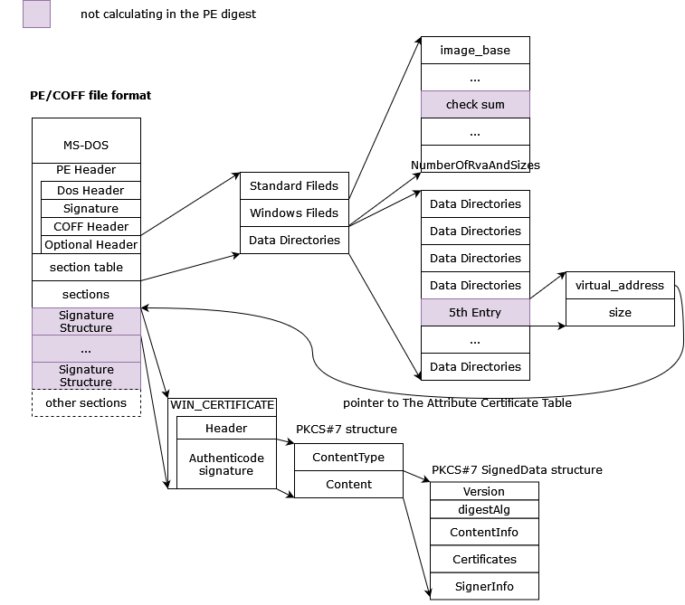
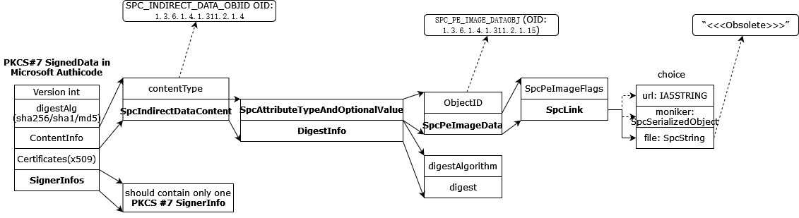

# How to sign an EFI image

## WHY

As [UEFI](https://en.wikipedia.org/wiki/UEFI) and [Secure boot](https://en.wikipedia.org/wiki/UEFI#Secure_Boot) was introduced, a signed UEFI executable is required in secure boot verification process to ensure the UEFI driver and/or OS boot loader are trusted.

## HOWs

In the latest [UEFI spec](https://uefi.org/specs/UEFI/2.10/32_Secure_Boot_and_Driver_Signing.html)(UEFI ver 2.10 is the latest in 2023/4), which explain the whole UEFI executable signature produce/verify process including the hows.

### What a signed UEFI executable looks like
As described in [UEFI spec](https://uefi.org/specs/UEFI/2.10/32_Secure_Boot_and_Driver_Signing.html), a Digital Signatures was embedded into the executable so that we can put the executable in any insecure location and verify the UEFI executable was not tampered.

Since the UEFI executable is a [PE/COFF format file](https://en.wikipedia.org/wiki/Portable_Executable) and the UEFI spec follow [Microsoft Authenticode Spec](https://download.microsoft.com/download/9/c/5/9c5b2167-8017-4bae-9fde-d599bac8184a/authenticode_pe.docx) to sign the executable, here's a brief sign outline and process:

1. using the method in `Microsoft Authenticode` to calculate the image digest(mostly sha256/sha1)
2. sign the `digest` using the private key from vendor to generate the `signature` in a PKCS #7 SignedData structure
3. embedded the `signature` into the executable and put the location and size of the signature in the `5th Data Directory` in PE/COFF file's `optional header`
4. the signature is a `WIN_CERTIFICATE` structure defined in[5], which come with a `wCertificateType=WIN_CERT_TYPE_PKCS_SIGNED_DATA` and the `bCertificate` formatted as a `PKCS#7 SignedData structure`
5. multi signatures are allowed in a single image(referred as signatures table blow), each signature MUST start at a virtual address aligned to quadword-aligned[2]
6. the signatures MAY end up with some zero-bytes so that the size of `signatures table` can be aligned to quadword

Here's an brief image to illustrate the signature outline.

### How to generate the PKCS #7 SignedData
The SignedData is a normal PKCS #7 SignedData with some tweaks defined in Authenticode Spec[1]

So in the SignedData structure, something we should keep in mind:
1. the ContentInfo contains a structure called `SpcIndirectDataContent` which is described in the Spec[1], and the oid is fixed `1.3.6.1.4.1.311.2.1.4`
2. the `SpcIndirectDataContent` was encoded in `binary DER-encoded ASN.1` format
3. the digest algorithm was a choice from `sha256(default)`, `sha1` and `MD5(backwards only)`(details below)
4. in Authenticode, only one `signerInfo structure` is needed in `signerInfos`

Here's an image to illustrate the signedData.

### How to generate the file digest
It's described in[1] in chapter `Calculating the PE Image Hash`
>To summarize, the hash calculation procedure includes:  
> •	Hashing the PE Header, omitting the file's checksum and the Certificate Table entry in Optional Header Data Directories (Steps 3 through 7).  
> •	Sorting and hashing the PE sections (steps 8 through 13).  
> •	Omitting Attribute Certificate Table from the hash calculation and hashing any remaining data (steps 14 and 15).  

### How to verify the signature
There're two steps to verify the signatures.
1. verify the integrity of the signature, the checks include:
    - There is ONE and only ONE SignerInfo in signedData
    - Digest algorithms are consistent (Signature.digest_algorithm == ContentInfo.digest_algorithm == SignerInfo.digest_algorithm)
    - Check that ContentInfo.digest matches the computed digest of the image(described above)
2. verify the certificates in PKCS7 signedData structure against with the trusted store

see the code[3] and code[4]

## References
1. [Windows Authenticode Portable Executable Signature Format](https://download.microsoft.com/download/9/c/5/9c5b2167-8017-4bae-9fde-d599bac8184a/authenticode_pe.docx)
2. [Microsoft Portable Executable and Common Object File Format Specification](https://learn.microsoft.com/en-us/windows/win32/debug/pe-format)
3. [verifying-windows-binaries-without-windows](https://blog.trailofbits.com/2020/05/27/verifying-windows-binaries-without-windows/)
4. [PE Authenticode by lief](https://lief-project.github.io/doc/latest/tutorials/13_pe_authenticode.html)
5. [WIN_CERTIFICATE](https://learn.microsoft.com/en-us/windows/win32/api/wintrust/ns-wintrust-win_certificate)
6. [UEFI Spec](https://uefi.org/specs/UEFI/2.10/32_Secure_Boot_and_Driver_Signing.html)
7. [signify](https://github.com/ralphje/signify/blob/master/signify/authenticode/structures.py)