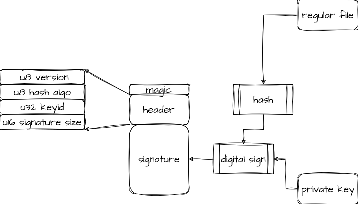

# What is a IMA file
The Linux [IMA](https://docs.openeuler.org/en/docs/21.09/docs/Administration/trusted-computing.html#kernel-integrity-measurement-architecture-ima)(Integrity Measurement Architecture) subsystem introduces hooks within the Linux kernel to support creating and collecting hashes of files when opened, before their contents are accessed for read or execute. The IMA subsystem has 2 subsystems within in it - measure and appraise. Measurement collects the hashes of files, while appraisal compares a collected hash to a stored hash and denies access in the event of a mismatch.[1]

To support proven integrity of the files, the IMA measurement subsystem can interact with the TPM chip within the system to protect the collected hashes from tampering by a rogue administrator or application.

The IMA measurement subsystem was added in linux-2.6.30. Appraisal came later, in linux-3.7.

Protection of the extended attribute itself is handled by EVM[2]

# EVM
In order to detect accidental or malicious modifications to a file, IMA is the way, As the IMA content can only be modified by superior user, but we must still make sure the value wont be tampered, so we have EVM(extended verification module), which utilize digital signature to protect the security extended attributes produced by IMA.

## How to generate the signatrue
Nowaday, there're two signature schemas to sign a IMA file, one is a compatible rsa way, we called `sign_v1`, other one is morden way we called `sign_v2`, here we just try to describe `sign_v2`:

1. the signatrue make up by a header and the signature
2. the signature was a normal digital signatrue signed by a private key, the `message digest` algo default to `sha256` for now and can range from `sha1, sha224, sha256, sha384, sha512`
3. the signed message is called a `evm_hash`, which is a simple hash of the IMA protected file and the `hash algo` is same with the `message digest` algo in `step 1`
4. the header contains a one btye magic which values `3` and a header which contains `sig_size`, `version`, `hash algo` and the `keyid`
5. the signatrue can be store in a detached file or directly in filesystem extend attribute



We can also using the `evmctl` from `ima-evm-utils` package to do the sign
```bash
evmctl ima_sign -a sha256 -f /path/to/file.txt -s /path/to/signature.sig -k /etc/keys/privkey_evm.pem
```

NOTICE:
1. the `sig_size` field in header is in `big endian` order, other fields are CPU endian
1. the `keyid` can be obtained from a `private key` in signing process and from a `public key` in verify process:
    1. in private key, keyid is the first 32-bits from the `X509 certificate subject key identifier` which can be retrieved by `x509_get_skid`
    1. in public key, keyid is the first 32-bits of sha1 fingerprint

## how to verify the signature
1. for schema v2, we just using the public key to verify the signature
2. make sure the `keyid` in `signature header` is same with the keyid in `public key`

We can also using the `evmctl` from `ima-evm-utils` package to do the verification
```bash
evmctl ima_sign -a sha256 -f /path/to/file.txt -s /path/to/signature.sig -k /etc/evm/pubkey_evm.pem
```

REFs:
1. https://wiki.gentoo.org/wiki/Integrity_Measurement_Architecture
2. https://docs.openeuler.org/en/docs/21.09/docs/Administration/trusted-computing.html#kernel-integrity-measurement-architecture-ima