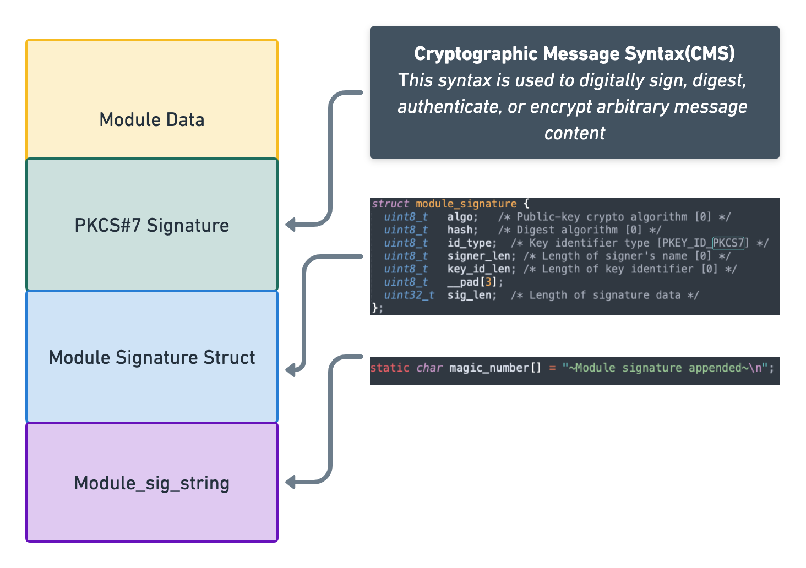

# How to sign a KernelModule (ko) file

## Background

KernelModule file is a file that can be loaded into the kernel at runtime, it's a binary file that contains the code and data that can be loaded into the kernel and run. And for the security concern we need to sign and verify the KernelModule file to make sure the file was not tampered.
There are two files located in the kernel repository that can be used to sign and verify the KernelModule file, they are `scripts/sign-file.c` and `scripts/extract-module-sig.pl`. 
The `sign-file.c` is used to sign the KernelModule file and the `scripts/extract-module-sig.pl` is used to extract the certificate from the signed KernelModule file.

## Signature Layout
The layout of signed KernelModule file is describe as below:



1. The raw content of kernel module file.
2. The CMS signature, and signature is a DER encoded PKCS#7 structure. The PKCS#7 structure contains the certificate and the signature of the file.
3. The ModuleSignature structure is appended after in the PKCS#7 structure, which contains the information of the signature.
4. The Module Magic string ("~Module signature appended~\n"), and it will be appended after the ModuleSignature structure, which is used to identify the signature.


## Sign the KernelModule file with sign-file.c
For Ubuntu, you can locate the sign-file tool with command:
```bash
tommylike@ubuntu  ~  /usr/src/linux-headers-$(uname -r)/scripts/sign-file
Usage: scripts/sign-file [-dp] <hash algo> <key> <x509> <module> [<dest>]
       scripts/sign-file -s <raw sig> <hash algo> <x509> <module> [<dest>]
```
sign-file support detached(-pd) and attached(-p) signature, considering you have generated the x509 key and cert, the command would as simple as:
```bash
tommylike@ubuntu  ~  /usr/src/linux-headers-$(uname -r)/scripts/sign-file -dp sha256 new.key new.crt simple.ko
```
Command used to check the cms signature in text format:
```bash
tommylike@ubuntu  ~/sign-kernelmodule  openssl pkcs7 -in  simple.ko.p7s -inform DER  -text
-----BEGIN PKCS7-----
MIIBygYJKoZIhvcNAQcCoIIBuzCCAbcCAQExDTALBglghkgBZQMEAgEwCwYJKoZI
hvcNAQcBMYIBlDCCAZACAQEwazBmMQ4wDAYDVQQDDAVpbmZyYTEOMAwGA1UECwwF
SW5mcmExDzANBgNVBAoMBkh1YXdlaTERMA8GA1UEBwwIU2hlblpoZW4xEzARBgNV
BAgMCkd1YW5nIERvbmcxCzAJBgNVBAYTAkNOAgEAMAsGCWCGSAFlAwQCATANBgkq
hkiG9w0BAQEFAASCAQBqyJT0Ibos7e38AM6ni5QYhkgwcMAYJV9MoOTX7MH3onhu
SBw1y1wpO1TIHonhmuRkc9Jqw5lVzaB2kvyHBOfwZBGZJ5BVqSJwq+KEU7e3uIQr
nm4/6mOPY+GS5khaq92b5k7Oq/iDPirD0Wle6dqSu6/0i0oEVUzvdEOwY9J6NK38
7EoP6RvN8YFm2rwxK9meaj8tWLsRdxtdiHscov/ZX/2TWV4VGRBAgzK5IdvfaTU6
yVr45nWbamXzgYXpI1Eb7sr5pZXnkk48SjNt+9uNku5eL0OthPx9n0VTlZ4gc+sD
8SPZGyjWyn+VvQlSrGaT/XD49e2sWqeJ/RvP0bqN
-----END PKCS7-----
```
or in ASN.1 format:
```bash
tommylike@ubuntu  ~/sign-kernelmodule  openssl asn1parse -inform der -in simple.ko.p7s
    0:d=0  hl=4 l= 458 cons: SEQUENCE
    4:d=1  hl=2 l=   9 prim: OBJECT            :pkcs7-signedData
   15:d=1  hl=4 l= 443 cons: cont [ 0 ]
   19:d=2  hl=4 l= 439 cons: SEQUENCE
   23:d=3  hl=2 l=   1 prim: INTEGER           :01
   26:d=3  hl=2 l=  13 cons: SET
   28:d=4  hl=2 l=  11 cons: SEQUENCE
   30:d=5  hl=2 l=   9 prim: OBJECT            :sha256
   41:d=3  hl=2 l=  11 cons: SEQUENCE
   43:d=4  hl=2 l=   9 prim: OBJECT            :pkcs7-data
   54:d=3  hl=4 l= 404 cons: SET
   58:d=4  hl=4 l= 400 cons: SEQUENCE
   62:d=5  hl=2 l=   1 prim: INTEGER           :01
   65:d=5  hl=2 l= 107 cons: SEQUENCE
   67:d=6  hl=2 l= 102 cons: SEQUENCE
   69:d=7  hl=2 l=  14 cons: SET
   71:d=8  hl=2 l=  12 cons: SEQUENCE
   73:d=9  hl=2 l=   3 prim: OBJECT            :commonName
   78:d=9  hl=2 l=   5 prim: UTF8STRING        :infra
   85:d=7  hl=2 l=  14 cons: SET
   87:d=8  hl=2 l=  12 cons: SEQUENCE
   89:d=9  hl=2 l=   3 prim: OBJECT            :organizationalUnitName
   94:d=9  hl=2 l=   5 prim: UTF8STRING        :Infra
  101:d=7  hl=2 l=  15 cons: SET
  103:d=8  hl=2 l=  13 cons: SEQUENCE
  105:d=9  hl=2 l=   3 prim: OBJECT            :organizationName
  110:d=9  hl=2 l=   6 prim: UTF8STRING        :Huawei
  118:d=7  hl=2 l=  17 cons: SET
  120:d=8  hl=2 l=  15 cons: SEQUENCE
  122:d=9  hl=2 l=   3 prim: OBJECT            :localityName
  127:d=9  hl=2 l=   8 prim: UTF8STRING        :ShenZhen
  137:d=7  hl=2 l=  19 cons: SET
  139:d=8  hl=2 l=  17 cons: SEQUENCE
  141:d=9  hl=2 l=   3 prim: OBJECT            :stateOrProvinceName
  146:d=9  hl=2 l=  10 prim: UTF8STRING        :Guang Dong
  158:d=7  hl=2 l=  11 cons: SET
  160:d=8  hl=2 l=   9 cons: SEQUENCE
  162:d=9  hl=2 l=   3 prim: OBJECT            :countryName
  167:d=9  hl=2 l=   2 prim: PRINTABLESTRING   :CN
  171:d=6  hl=2 l=   1 prim: INTEGER           :00
  174:d=5  hl=2 l=  11 cons: SEQUENCE
  176:d=6  hl=2 l=   9 prim: OBJECT            :sha256
  187:d=5  hl=2 l=  13 cons: SEQUENCE
  189:d=6  hl=2 l=   9 prim: OBJECT            :rsaEncryption
  200:d=6  hl=2 l=   0 prim: NULL
  202:d=5  hl=4 l= 256 prim: OCTET STRING      [HEX DUMP]:6AC894F421BA2CEDEDFC00CEA78B941886483070C018255F4CA0E4D7ECC1F7A2786E481C35CB5C293B54C81E89E19AE46473D26AC39955CDA07692FC8704E7F0641199279055A92270ABE28453B7B7B8842B9E6E3FEA638F63E192E6485AABDD9BE64ECEABF8833E2AC3D1695EE9DA92BBAFF48B4A04554CEF7443B063D27A34ADFCEC4A0FE91BCDF18166DABC312BD99E6A3F2D58BB11771B5D887B1CA2FFD95FFD93595E151910408332B921DBDF69353AC95AF8E6759B6A65F38185E923511BEECAF9A595E7924E3C4A336DFBDB8D92EE5E2F43AD84FC7D9F4553959E2073EB03F123D91B28D6CA7F95BD0952AC6693FD70F8F5EDAC5AA789FD1BCFD1BA8D
```

## Sign the KernelModule file with signatrust
Signatrust support sign KernelModule file within the command as following:
```bash
 RUST_BACKTRACE=full RUST_LOG=debug ./target/debug/client --config /path/to/client.toml add  --key-name default-x509  --file-type kernel-module --key-type x509 .data/simple.ko
```
Signatrust supports to resign a signed KernelModule file, that's to say instead of append the cert and metadata at the end of file, signatrust will try to parse the kernel module file and replace the signature when resigning.
if you add the `--detached` flag, the signature will be detached from the file as `sign-file` tool, and the signature will be output to the file with the same name as the file to be signed, but with the extension .p7s appended to the file name.
```bash
 RUST_BACKTRACE=full RUST_LOG=debug ./target/debug/client --config /path/to/client.toml add  --key-name default-x509  --file-type kernel-module --key-type x509 --detached .data/simple.ko
```

## Verify the Signature of KernelModule file
In order to verify the signature of KernelModule file, you need to extract the signature from the file first, and then verify the signature with the extracted signature and the original file.
1. Download the certificate from signatrust control-server and save it into local file(new.cert as below) in pem format:
```shell
curl -X 'POST' \
  'https://localhost:8080/api/v1/keys/<key-id-or-name>/certificate' \
  -H 'accept: application/json' \
  -H 'Authorization: cBnLPLXl1fA7fKDZnjg9fd9dSWw2RXtUH3MGFUtq' \
  -d ''
```
2. Extract the signature from the KernelModule file or use detached signature(.p7s)
```bash
 tommylike@ubuntu  ~/sign-kernelmodule  perl extract-module-sig.pl -s simple.ko > detached.p7s
perl: warning: Setting locale failed.
perl: warning: Please check that your locale settings:
	LANGUAGE = (unset),
	LC_ALL = (unset),
	LC_TERMINAL = "iTerm2",
	LC_CTYPE = "UTF-8",
	LANG = "en_US.UTF-8"
    are supported and installed on your system.
perl: warning: Falling back to a fallback locale ("en_US.UTF-8").
Read 15805 bytes from module file
Found magic number at 15805
Found PKCS#7/CMS encapsulation
Found 461 bytes of signature [308201c906092a864886f70d010702a0]
```
3. Verify the signature
```bash
openssl smime -verify -binary -inform DER -in detached.p7s  -content simple.ko -certfile new.crt -nointern -noverify
......
......
Verification successful
```


