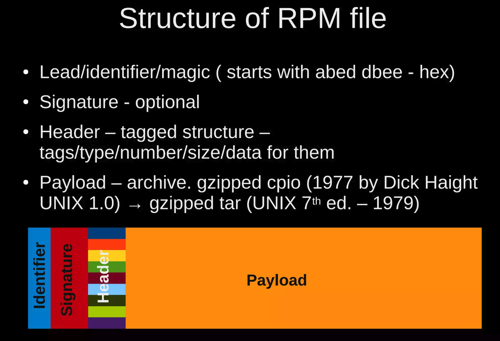

# How to sign an RPM file

## Background

RPM file is a package format used by openEuler, Red Hat and its derivatives, such as CentOS, Fedora, etc. RPM file is a
compressed archive file, which contains the files to be installed and the metadata of the package. The metadata of the 
package is stored in the header of the RPM file, and the header is signed by the private openPGP key of the package maintainer. 
The signature is used to ensure the integrity of the package and the authenticity of the package maintainer.

## Signature Layout
The layout of RPM file is described as below:



And these tags below will be used for signing:
1. **RPMSIGTAG_SIZE**: the combined size of Header and Payload
2. **RPMSIGTAG_PAYLOADSIZE**: the size of Payload before compressing。
3. **RPMSIGTAG_SHA1**: SHA1 digest of Header Section。
4. **RPMSIGTAG_MD5**: MD5 digest of Header and Payload。
5. **RPMSIGTAG_DSA**: The DSA signature of Header section，used with GPG Header
6. **RPMSIGTAG_RSA**: The RSA signature of Header section，used with PGP Header
7. **RPMSIGTAG_PGP**: RSA of Header section and Payload section, used with RSA Header。
8. **RPMSIGTAG_GPG:** DSA of Header section and Payload section, used with DSA Header。


## Sign the RPM&SRPM with Signatrust
Signatrust support sign RPM file within the command as following:
```bash
 RUST_BACKTRACE=full RUST_LOG=debug ./target/debug/client --config /path/to/client.toml add  --key-id default-pgp --file-type rpm --key-type pgp .data/simple.rpm
```

## Verify the Signature of RPM file
In order to verify the signature of rpm file, you need to download the openPGP public key and use rpm command to verify the signature.
1. Download the public key from signatrust control-server and save into local file(new.key as below) in text format:
```shell
curl -X 'POST' \
  'https://localhost:8080/api/v1/keys/<key-id>/public_key' \
  -H 'accept: application/json' \
  -H 'Authorization: cBnLPLXl1fA7fKDZnjg9fd9dSWw2RXtUH3MGFUtq' \
  -d ''
```
2. Import the public key into rpm database.
```bash
 tommylike@ubuntu  ~/sign-kernelmodule  rpm --import new.key
```
3. Verify the signature
```bash
➜ git:(master) ✗ rpm -Kv simple.rpm      
simple.rpm:
    Header V4 RSA/SHA256 Signature, key ID dceaeea8: NOKEY
    Header SHA1 digest: OK
    Payload SHA256 digest: OK
    V4 RSA/SHA256 Signature, key ID dceaeea8: NOKEY
    MD5 digest: OK

```


